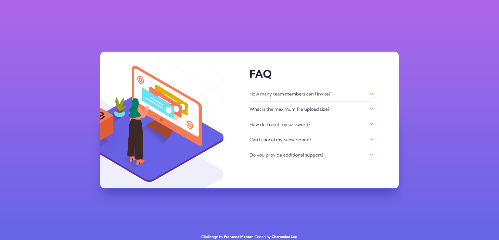

# Frontend Mentor - FAQ accordion card solution

This is a solution to the [FAQ accordion card challenge on Frontend Mentor](https://www.frontendmentor.io/challenges/faq-accordion-card-XlyjD0Oam). Frontend Mentor challenges help you improve your coding skills by building realistic projects.

## Table of contents

- [Overview](#overview)
  - [The challenge](#the-challenge)
  - [Screenshot](#screenshot)
  - [Links](#links)
- [My process](#my-process)
  - [Built with](#built-with)
  - [What I learned](#what-i-learned)
  - [Continued development](#continued-development)
- [Author](#author)
- [Acknowledgments](#acknowledgments)

## Overview

### The challenge

Users should be able to:

- View the optimal layout for the component depending on their device's screen size
- See hover states for all interactive elements on the page
- Hide/Show the answer to a question when the question is clicked

### Screenshot

### Links

- Solution URL: [Click here!](https://www.frontendmentor.io/solutions/collapsible-faq-card-using-html-css-and-js-1PlELJw9o)
- Live Site URL: [Click here!](https://epic-lichterman-7f8205.netlify.app/)

## My process

### Built with

- Semantic HTML5 markup
- CSS custom properties
- Flexbox
- CSS Grid
- Mobile-first workflow

### What I learned

- Use grid to stack grid children
- Text-align CSS property can also be used to align images centrally

### Continued development

- More practice in DOM manipulation using javascript
- Learn about how we can use javascript to override certain properties defined with CSS

## Author

- LinkedIn - [Charmaine Lee](https://www.linkedin.com/in/charmainelee-huimin/)
- Frontend Mentor - [@charmainelhm](https://www.frontendmentor.io/profile/charmainelhm)
- Twitter - [@noodercob_ie](https://www.twitter.com/noodercob_ie)

## Acknowledgments

Practice is a very important learning stage in coding, and I want to thank [Frontend Mentor](https://www.frontendmentor.io/) for making it easier for me to do that. With their help, I can focus on understanding the different properties in HTML and CSS with my minimal knowledge on UI and UX design.
